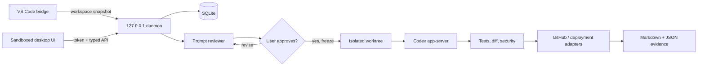

# Personal Codex Agent

Personal Codex Agent is a Windows-first, single-user desktop application that turns an incomplete
software request into a frozen, testable specification and then runs the approved work through
Codex in an isolated Git worktree. It combines an Electron/React desktop client, a loopback-only
Node daemon, a small VS Code workspace bridge, SQLite run history, deterministic orchestration,
Git/GitHub adapters, quality gates, deployment/rollback adapters, and evidence reports.

No repository write or Codex implementation turn is allowed before the user approves a prompt
revision. GitHub and deployment stages are skipped honestly when they are not configured.



## Quick start

Node.js 22.5+ and npm are required. Git is required for repository lifecycle operations. VS Code,
Codex, and GitHub CLI are integrations: their absence does not prevent the desktop shell or manual
folder mode from starting.

Runnable command for this computer:

```powershell
Set-Location "C:\Users\Jamie Kanbier\Documents\Coding agent"
.\scripts\bootstrap.ps1
npm run dev
```

Generic example — replace the visibly marked placeholder before running:

```powershell
Set-Location "<YOUR-AGENT-REPOSITORY-PATH>"
.\scripts\bootstrap.ps1
npm run dev
```

The PowerShell scripts derive the repository root from `$PSScriptRoot`, so they also work from a
different current directory and with spaces in the path.

Install optional integrations only when needed:

```powershell
npm install -g @openai/codex
codex login
winget install --id GitHub.cli -e
gh auth login
.\scripts\install-vscode-extension.ps1
```

Open a Git project in VS Code, verify the exact workspace in the desktop header, submit a prompt,
answer only the material questions, review the diff, and select **Approve & execute**.

## Commands

| Command                    | Purpose                                                  |
| -------------------------- | -------------------------------------------------------- |
| `npm run dev`              | Start daemon, Vite renderer, and Electron desktop        |
| `npm run build`            | Build daemon, desktop, and extension                     |
| `npm test`                 | Run all deterministic tests                              |
| `npm run test:unit`        | Unit tests                                               |
| `npm run test:integration` | SQLite, Git, workspace, reporting tests                  |
| `npm run test:e2e`         | Authenticated local API workflow                         |
| `npm run test:security`    | Token, path, redaction, and Electron isolation tests     |
| `npm run lint`             | Strict ESLint                                            |
| `npm run typecheck`        | Strict TypeScript                                        |
| `npm run package`          | Unsigned Windows directory, VSIX, and SHA-256 checksums  |
| `npm run doctor`           | Prerequisite and authentication diagnostics              |
| `npm run doctor -- --json` | Machine-readable diagnostics used by Setup & Connections |

## Packages and artifacts

- Desktop: `artifacts/desktop/Personal Codex Agent-win32-x64/Personal Codex Agent.exe`
- Daemon build: `dist/daemon/index.js`
- VS Code extension: `artifacts/personal-codex-agent-vscode-0.2.0.vsix`
- Checksums: `artifacts/SHA256SUMS.txt`
- Per-run evidence: `<project>/.agent-runs/<run-id>/`

The Windows build is intentionally unsigned because no signing certificate is available. Windows
may show a SmartScreen warning. See [the setup guide](docs/user-setup-guide.md) for exact steps and
[the security model](docs/security-model.md) before enabling automatic GitHub or deployment stages.

## Documentation

- [Architecture](docs/architecture.md)
- [Windows setup and first run](docs/user-setup-guide.md)
- [Developer guide](docs/developer-guide.md)
- [Codex integration](docs/codex-integration.md)
- [GitHub lifecycle](docs/github-integration.md)
- [Deployment and rollback](docs/deployment-configuration.md)
- [Security model](docs/security-model.md)
- [Testing strategy](docs/testing-strategy.md)
- [Troubleshooting](docs/troubleshooting.md)

Version: **0.2.0**. See [CHANGELOG.md](CHANGELOG.md).
